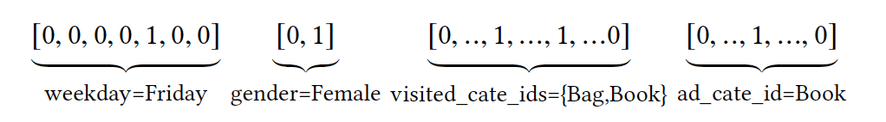

# 1. 概述
&emsp;CTR预估(Click-through rate prediction)是工业界中重要的应用，如在线广告，本文主要介绍目前主流的ctr模型从传统的**浅层模型**到目前的**深度模型**进行简单的介绍。
&emsp;在ctr的应用场景中，数据的特点一般是：高维、稀疏、多域的，一般对不同的域进行one-hot或multi-hot操作操作，如下图所示，一个电商中的场景中，weekday进行one-hot的表示，和visited_cat_ids的multi-hot的表示:

通常对于one-hot特征一般进行embedding-based的方法将one-hot映射称**低维稠密向量**，用来减少数据维度。

# 2. LR(logistic regression)
lr是一种广义的线性模型，可以看做是一个没有隐层的神经网络模型,其公式为:
$$y = \frac{1}{1+e^{-w^Tx}}$$

LR模型一直是CTR预估问题的benchmark模型，由于其简单、易于并行化实现、可解释性强等优点而被广泛使用。然而由于线性模型本身的局限，不能处理特征和目标之间的非线性关系，因此模型效果严重依赖于算法工程师的特征工程经验。

**一个自然的问题是如何学习原始特征和拟合目标之间的非线性关系？**

1. 连续特征离散化
   如将年龄这种连续的特征进行离散化，分段处理，增加模型的鲁棒性
2. 特征交叉
   非常重要的特征工程，单个特征的贡献弱，组合不同的特征可能具有较强的相关性。如将”男性“和”足球“进行特征组合，特征交叉简单，可解释性强，易并行，但是需要大量的特征工程。

# 3. GBDT + LR 
特征工程很难做，且比较耗时，那么如何进行自动完成呢？一种解决思路是使用模型级联，我们知道树模型可以做特征的非线性变化。因此将特征分成两个部分
1. GBDT: 对连续值、值空间不大的category特征
2. LR: 空间很大的ID特征
一般使用GBDT输出的叶子节点进行编号，然后使用LR进行训练。
两者的组合既能做高阶的特征组合(GBDT),又能利用线性模型易于处理大规模数据的优势(LR)，将GBDT和LR的优势整合起来。

# 4. FM, FFM
LR模型中很容易引入特征组合，如一个简单的二阶特征组合方式:
$$\hat{y} = w_0 + \sum_{i=1}^nw_i.x + \sum_{i=1}^n\sum_{j=i+1}^nw_{i,j}.x_ix_j$$
其优点是加入了特征组合，但是缺点是，组合特征的泛华能力弱。因为只有当$x_i, x_j$同时出现时，$w_{i,j}$才不等于0，否自其为0.尤其是在大规模稀疏特征存在的场景下，比如CTR预估和推荐排序，这些场景的最大特点就是特征的大规模稀疏

因子分解机(Factorization Machines, FM)通过特征对之间的隐变量内积来提取特征组合，其函数形式如下：
$$\hat{y} = w_0 + \sum_{i=1}^nw_i.x + \sum_{i=1}^n\sum_{j=i+1}^n<v_i,v_j>x_ix_j   （1）$$
$$<v_i,v_j> = \sum_f^k{v_{i,f}{v_{j,f}}}, 即两个k维向量的乘积: v_i^T.v_j$$

FM对于每个特征，学习一个大小为k的一维向量，于是，两个特征 $v_i$ 和$v_j$ 的特征组合的权重值，这本质上是在对特征进行embedding化表征，和目前非常常见的各种实体embedding本质思想是一脉相承的，

在实现中，通常会随机的初始化每个特征为k维的向量，然后通过训练，最终学习到每个特征的embedding向量。

**可以看到，即使$x_i,x_j$没有同时出现，其权重值仍然不为0，因此泛化能力得到提升**

上述公式1可以看到，其实o(n^2)的，在大规模的稀疏数据场景中是不可用的，但是其可以通过公式变成o(kn)的常数复杂度:

# 5. Wide & Deep

# 6. FNN

# 7. PNN

# 8.DeepFM

# 9. Deep & Cross

# 10. DIN

# 参考资料
- [推荐系统召回四模型之：全能的FM模型](https://zhuanlan.zhihu.com/p/58160982)

